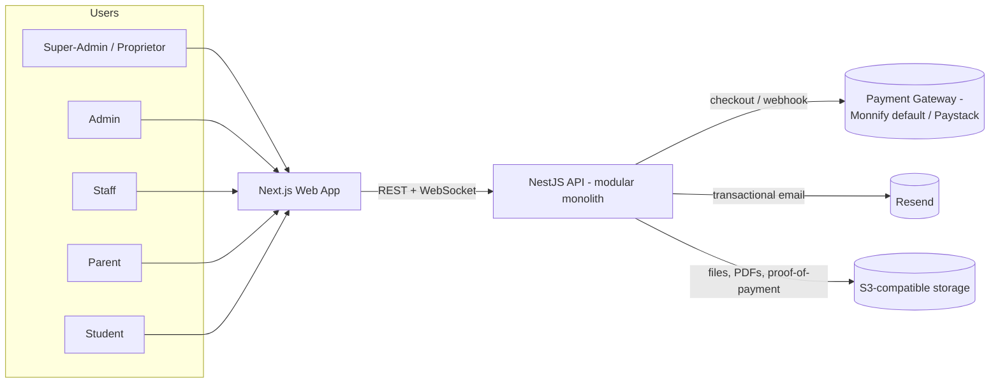
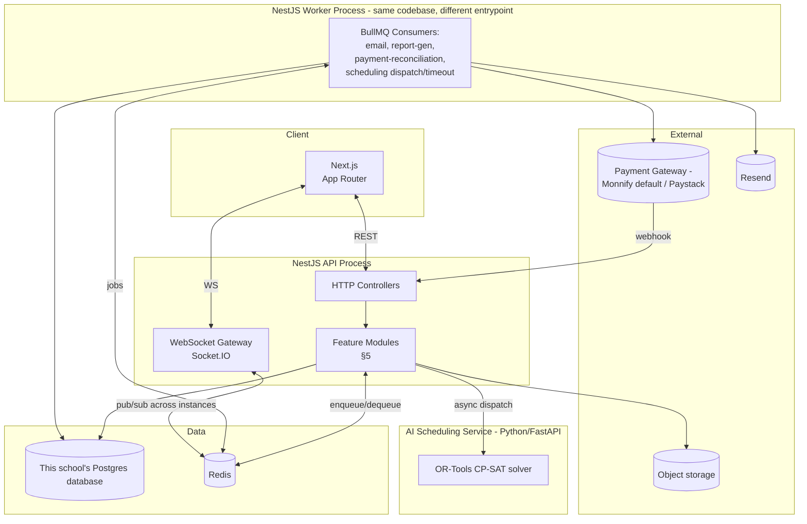
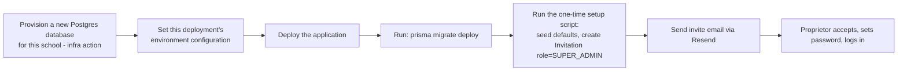
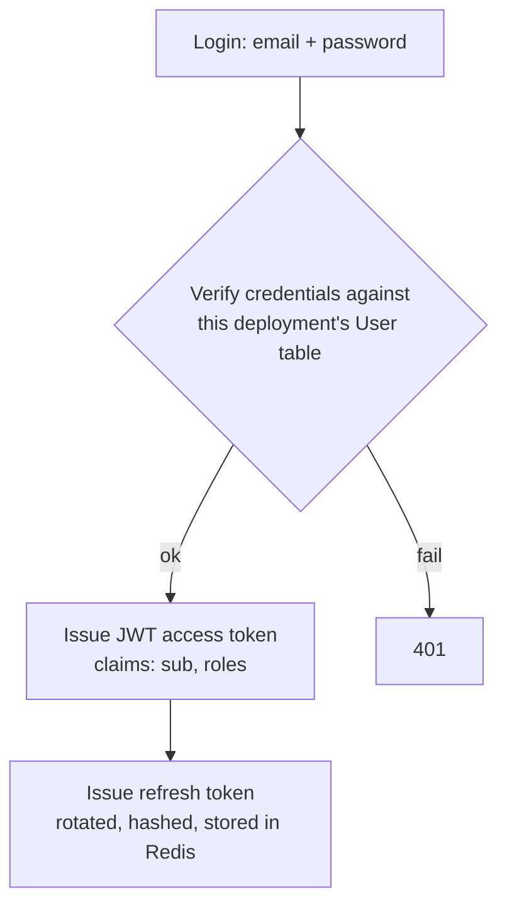
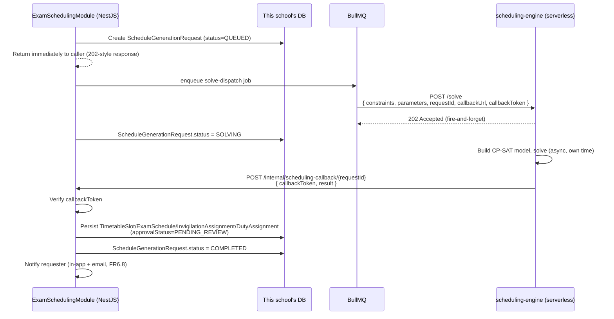
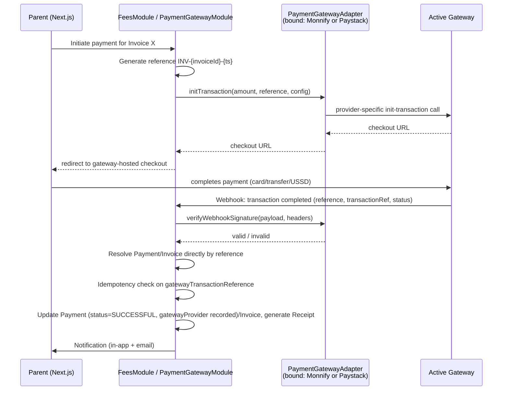
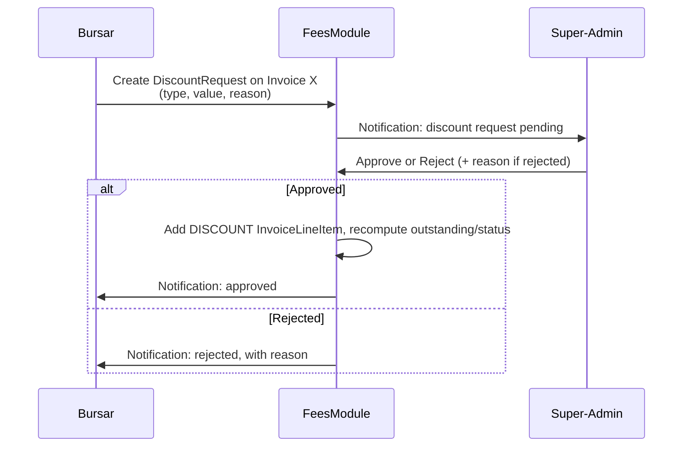
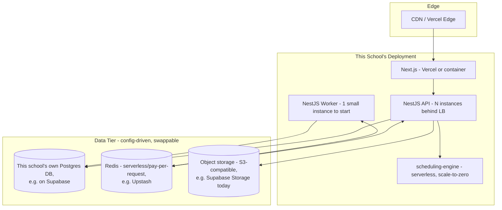

# Architecture Plan: School Management System

**Status:** Draft v1.0
**Companion to:** [PRD.md](./PRD.md) — this document answers *how* the system in the PRD gets built: component boundaries, request flows, and deployment topology. Data model details (tables/columns) live in the PRD §3 and aren't repeated here except where architecture depends on them.

---

## 1. Architecture Style & Principles

- **Modular monolith, not microservices** — one NestJS application, internally organized into strict feature modules with clear boundaries (§5). At this stage (pre-launch, small team), microservices add deployment/ops overhead without a corresponding benefit — there's no module here that needs to scale, deploy, or fail independently of the others *except one* (below).
- **One deliberate exception: the AI scheduling engine is a separate service.** Constraint-solving (OR-Tools CP-SAT) is best supported in Python, not Node — rather than fight the ecosystem, it's a small, stateless Python service the NestJS monolith calls internally (§9). This is the one place "microservice" is the right call, and only because of the language boundary, not for scaling reasons.
- **Single-tenant, one application per school** — carried over from the PRD (§2.2 there). Each school's deployment talks to exactly one database. There is no dynamic tenant-resolution machinery anywhere in this codebase — no per-request "which database" step, no tenant claim, no multi-client connection pool. §6 covers what's left of that concern, which is not much.
- **Everything else follows from the PRD's non-functional requirements** (§7 there): isolation by deployment, invitation-only auth, a pluggable payment gateway integration (Monnify default, Paystack also supported — §5, §10) rather than a single hardcoded provider.

---

## 2. System Context



Every user authenticates against **this one deployment's database** — there is no multi-database resolution to reason about, and no actor in the system that spans more than one school. If the same product serves other schools, that's a structurally identical, entirely separate instance of this same diagram, not another branch inside this one.

---

## 3. High-Level Components



Two deployable NestJS artifacts share one codebase: an **API process** (handles HTTP + WebSocket) and a **worker process** (drains BullMQ queues). Splitting them lets a slow report-generation job or a payment-reconciliation sweep never compete with request-handling threads, and lets you scale each independently — both still talk to the same single database.

---

## 4. Repository Structure (Monorepo)

```
school-management/
├── apps/
│   ├── api/                 # NestJS — HTTP + WebSocket entrypoint
│   ├── worker/               # NestJS — BullMQ consumer entrypoint (shares modules with api/)
│   ├── web/                  # Next.js App Router
│   └── scheduling-engine/    # Python FastAPI + OR-Tools — the one non-TS service
├── packages/
│   ├── types/                 # Shared DTOs / Zod schemas — single source of truth for API contracts
│   ├── eslint-config/
│   ├── tsconfig/
│   └── ui/                    # Shared Tailwind/React components, if the design system grows
├── prisma/
│   └── schema.prisma          # One schema, one migration history — this deployment's database
├── infra/
│   ├── docker/                # Dockerfiles per app
│   └── docker-compose.yml     # Local dev: one Postgres DB, Redis
└── turbo.json
```

`apps/api` and `apps/worker` both import from a shared internal `libs/` (or a private workspace package) containing the feature modules in §5 — they are two thin entrypoints wrapping the same business logic, not two copies of it.

There is a **single** Prisma schema, not a split between a control-plane and a tenant schema — there's only one database per deployment, so there's only one thing to model.

---

## 5. Backend Module Map (NestJS)

Each module below corresponds to a section of PRD §3. Arrows are compile-time dependencies (imports), not runtime calls.

| Module | Owns (PRD tables) | Depends on |
|---|---|---|
| `AuthModule` | JWT issuance/validation, refresh tokens | `IdentityModule` |
| `IdentityModule` | `User`, `UserRole`, `Invitation`, `AdminProfile`, `StaffProfile`, `ParentProfile`, `StudentProfile`, `StudentGuardian` | — |
| `AcademicStructureModule` | `SchoolProfile`, `AcademicSession`, `Term`, `ClassLevel`, `ClassArm`, `Department`, `StudentDepartment` | `IdentityModule` |
| `SubjectModule` | `Subject`, `ClassSubject`, `SubjectGroupWeight`, `StudentSubjectEnrollment` | `AcademicStructureModule` |
| `StaffModule` | `StaffAssignment`, `StudentPosition` | `IdentityModule`, `AcademicStructureModule` |
| `AssessmentModule` | `AssessmentComponent`, `ScoreEntry`, `SubjectTermResult`, `GradeScale`, `SkillAssessmentItem`, `SkillRating`, `ReportWindow`, `ReportComment`, `TermReportCard` | `SubjectModule`, `StaffModule` |
| `CalendarModule` | (no new tables — read-aggregation, PRD §3.11) | `AcademicStructureModule`, `AssessmentModule`, later `ExamSchedulingModule` |
| `AttendanceModule` | `AttendanceSession`, `AttendanceRecord` | `StaffModule` |
| `TimetableModule` | `TimetableSlot` | `SubjectModule`, `StaffModule` |
| `ExamSchedulingModule` | `ExamSchedule`, `InvigilationAssignment`, `DutyAssignment`, `SchedulingConstraint`, `ScheduleGenerationRequest` | `AssessmentModule`, `StaffModule`, calls out to `scheduling-engine` (§9) |
| `FeesModule` | `FeeStructure`, `Invoice`, `InvoiceLineItem`, `Payment`, `Receipt`, `PaymentGatewayConfig`, `DiscountRequest` | `AcademicStructureModule` |
| `PaymentGatewayModule` | (no new tables — integration logic) | `FeesModule` |
| `NotificationsModule` | `NotificationTemplate`, `Notification`, `EmailLog`, `NotificationPreference` | `IdentityModule` |
| `AuditModule` | `AuditLog` | injected into every write-path module as a cross-cutting interceptor |

`AuditModule` is intentionally cross-cutting (a Nest interceptor, not something other modules import and call) — this is how "log who changed what" stays consistent without every module remembering to call it.

**`StorageModule`** (used by `AssessmentModule` for report-card PDFs, `IdentityModule` for avatars, `FeesModule` for Bursar-uploaded proof-of-payment images/PDFs, etc.) wraps file storage behind a small `StorageAdapter` interface (`put`, `getSignedUrl`, `delete`). Today's concrete implementation talks to Supabase Storage (S3-compatible, convenient if the database is also on Supabase — PRD §2.1), but nothing outside this one module knows that — moving to AWS S3 or another S3-compatible provider later means writing a new adapter and changing one config value, not touching every place a report card or avatar gets uploaded.

**`PaymentGatewayModule`** follows the same swap-later shape as `StorageModule`: a `PaymentGatewayAdapter` interface (`initTransaction`, `verifyTransaction`, `verifyWebhookSignature`) with one concrete implementation per provider — `MonnifyAdapter` and `PaystackAdapter` today. `FeesModule` only ever calls the interface, never a provider SDK directly. Which adapter is bound at boot is decided by `PAYMENT_GATEWAY_PROVIDER` (default `MONNIFY`), read once via NestJS DI the same way `DATABASE_URL`/storage config are — see §10 for the full flow and why credentials for more than one provider can be configured at once.

---

## 6. Application Bootstrap & Configuration

There is deliberately very little to say here, and that's the point. With one database per deployment, there is no per-request "which tenant" resolution step at all:

- A single Prisma client is instantiated **once, at process startup**, from environment configuration (`DATABASE_URL` and friends) and reused for the lifetime of the process via normal NestJS dependency injection.
- No middleware resolves a tenant, no request context carries a tenant identifier, no connection factory maintains a cache of per-tenant clients. A service simply injects the Prisma client and queries — the same as any ordinary single-tenant application.
- The JWT carries `sub` (user id) and `roles` — nothing tenant-related, because there's nothing to disambiguate.
- Environment configuration (database connection, Redis, Resend key, this school's payment gateway credentials plus `PAYMENT_GATEWAY_PROVIDER` selecting which one is active, storage credentials, the envelope-encryption master key) is exactly what any single-tenant app needs — and it's still config, not hardcoded — so moving any one of these to a different provider later is a configuration change plus a redeploy, not an application rewrite.

### 6.1 New School Setup

Provisioning a new school is **not an application feature** — there is no in-app screen or role that does this, because doing it would imply this deployment somehow knows about or could reach another school's data, which is exactly the thing single-tenancy rules out. Instead, standing up a school's deployment is an infrastructure activity:



- Steps A–C are ordinary deployment/infrastructure work (a script, an IaC module, or a hosting platform's "new app" flow) — nothing about them is specific to this application beyond "it needs a Postgres database and some environment variables."
- Step E is the one application-specific piece: a small CLI command (e.g. `pnpm setup:school --proprietor-email=...`) that seeds `GradeScale`, `SchedulingConstraint`, and `NotificationTemplate` defaults, then creates the school's first `Invitation` (`SUPER_ADMIN`). It's a one-shot script, not a recurring job — there's no `TenantProvisioningJob`-style status table to track, because there's nothing recurring or asynchronous about it worth persisting; if it fails partway, re-running it against the same (still-empty-of-real-data) database is safe.
- This whole flow runs **once per school**, at the time that school's deployment is first stood up. Operating many schools means running this flow many times, once per independent deployment — not once against a shared system.

### 6.2 Updating an Existing School's Deployment

Schema and code changes apply to **one database, one deployment** at a time — the standard `prisma migrate deploy` + redeploy flow any single-tenant application uses. There is no fleet-wide migration runner inside the application, because the application has no concept of a fleet.

If the same team operates several schools' independent deployments, "roll out a change to everyone" means redeploying each one — most naturally via one shared, parameterized CI/CD pipeline template (§12) triggered once per school, each pointed at that school's own environment configuration, rather than any in-app mechanism. That's an operational/DevOps concern, not something this document's architecture needs to solve inside the running application.

---

## 7. Auth Architecture



- **No tenant/school-selection step** — login is exactly as simple as it looks above, because there's exactly one school's `User` table to check credentials against.
- **Invitation acceptance** is a distinct, unauthenticated-but-tokenized flow: `GET /invitations/:token` validates the hashed token server-side, and `POST /invitations/:token/accept` sets the password and activates the account — never a generic "create account" endpoint.
- **RBAC via CASL**, not hand-rolled `if (role === 'ADMIN')` checks scattered across controllers. An `AbilityFactory` builds a per-request `Ability` from the user's roles + active `StaffAssignment`/`UserRole` rows (e.g. "can update `ScoreEntry` where `subjectId` in [ids from my active SUBJECT_TEACHER assignments]"), and a single `PoliciesGuard` enforces it. This is what makes scoped rules like "class teacher sees only her class" (PRD §5) enforceable in one place instead of re-implemented per-endpoint — this is the permission boundary that actually matters in a single-tenant app, since the tenant boundary is handled for free by deployment isolation.
- **Secrets**: `PaymentGatewayConfig.apiKey`/`secretKey` are never stored as plaintext columns, for any provider row — envelope-encrypted at the application layer before being written, decrypted only in-memory when a call to that provider's API is made (via the bound `PaymentGatewayAdapter`, §5). The database connection string itself is ordinary deployment configuration (an environment variable/secret managed by the hosting platform), not something the application encrypts and stores in a table — there's no dynamic database-secret management to do when there's only ever one connection.

---

## 8. Real-Time & Background Jobs

- **WebSocket Gateway** uses the Socket.IO Redis adapter so a notification emitted from any API or worker process instance reaches a client connected to *any* other instance — relevant as soon as this school's deployment runs more than one API process behind a load balancer. Rooms are scoped `user:{userId}` — no tenant prefix needed.
- **BullMQ queues**, each with its own concurrency/retry policy: `email-dispatch` (Resend sends via apps/worker's `EmailProcessor`, exponential backoff, max 3 attempts — producer side lives in both apps/api's `NotificationService.notify()` and apps/worker's own `WorkerNotificationService`, see below), `report-card-generation` (PDF rendering, CPU-heavier, lower concurrency), `assessment-schedule-sweep` (transitions `AssessmentComponent`/`ReportWindow` status off their date fields, PRD §3.6 — same generic scheduled-sweep shape as `payment-reconciliation`/`invoice-overdue-sweep`/`scheduling-timeout-sweep` below, reused rather than redesigned per BUILD_PLAN §1's "plumbing before logic, where a pattern repeats" principle), `payment-reconciliation` (§10 — polls whichever gateway a given `PENDING` `Payment.gatewayProvider` was made through via that provider's `PaymentGatewayAdapter`; `PENDING_APPROVAL` manual bank-transfer submissions are never enqueued here, since they resolve only through explicit Super-Admin review, not polling), `invoice-overdue-sweep` (hourly — date-granularity, not minute-granularity, so it doesn't need the other sweeps' 5-minute cadence; flips a past-due `Invoice` to `OVERDUE` and notifies every guardian via `WorkerNotificationService`), `scheduling-solve-dispatch` (hands a solve request to the scheduling-engine, §9), `scheduling-timeout-sweep` (catches a `ScheduleGenerationRequest` that never got a callback, §9). The scheduling callback itself (`POST /internal/scheduling-callback/:requestId`) is handled directly by a controller, not queued — it's a single quick write, not a job. All queued work runs in the `worker` process (§3), not the API process, so a burst of report-card generation never delays a login request.
- **`WorkerNotificationService`** (apps/worker/src/notifications/): `NotificationService` (template render, preference check, `Notification`/`EmailLog` writes) lives in apps/api, unreachable from apps/worker across the process boundary — so a worker-originated trigger (currently: `invoice-overdue-sweep`) needs its own copy. A deliberate, documented duplication of `NotificationService.notify()`'s core, minus the live WebSocket push (no gateway in the worker process — same "duplicated per-process, not shared" precedent as `PaymentService.resolveGatewayOutcome`/`parseCorsOrigins`). A worker-originated in-app notification appears on the recipient's next `GET /notifications` poll or socket reconnect, not instantly — an accepted degradation, not a silent gap.
- **The WebSocket handshake and the httpOnly-cookie proxy don't mix** — apps/web's access/refresh tokens live in httpOnly cookies read only by its own `/api/proxy` route handler (server-side), but Socket.IO's `auth: { token }` handshake is inherently client-side JS, which can't read an httpOnly cookie. Bridged with one narrow `GET /api/socket-token` Next.js route that reads the cookie server-side and hands the current token to already-authenticated client code — nothing else changes about the cookie's httpOnly-ness.

---

## 9. AI Scheduling Service Boundary

The solver call is **asynchronous end-to-end** — the request that triggers generation (PRD FR6.2–FR6.4) returns immediately, and the caller finds out later (via in-app notification, FR6.8) that a draft is ready to review. This avoids holding an HTTP connection or a request thread open for however long a CP-SAT solve takes, and tolerates the scheduling-engine restarting or scaling to zero between request and response.



- **`ScheduleGenerationRequest` (PRD §3.8) is the tracking record for the in-flight request** — it's what lets the UI show "generating…" and what a timeout sweep (below) checks, since there are no `TimetableSlot`/`ExamSchedule`/`InvigilationAssignment`/`DutyAssignment` rows to point to until the callback arrives. Its `parameters` jsonb column carries run-specific overrides the Python solver should apply for that one run — e.g. a mid-term exam run's max-subjects-per-day and calculation/non-calculation duration values (PRD FR6.3a), or a weekly-duty run's `teachersPerWeek` (FR6.11) — layered on top of whatever `constraints` (the resolved `SchedulingConstraint` rows for that scope) already supply as defaults.
- **The Python service is stateless and has no database credentials at all** — it receives a fully-formed constraint payload plus a callback URL/token, and calls back with a result; it never touches Postgres directly. This keeps "only NestJS talks to the database" true, and means this component holds no data belonging to this school (or any school) at rest.
- **Callback authentication**: `callbackToken` is a single-use, per-request secret generated when the job is dispatched, not a shared static API key — so a stray or replayed callback can't be mistaken for a legitimate one, and it's scoped to exactly one `ScheduleGenerationRequest`.
- **Timeout fallback (mirrors the payment reconciliation pattern in §10)**: a scheduled BullMQ job checks for any `ScheduleGenerationRequest` still `QUEUED`/`SOLVING` past a configurable threshold (default 10 minutes, PRD FR6.9) and marks it `TIMED_OUT` with a user-facing notification — a crashed or lost solver run is never silently stuck.
- **Hosting: serverless, scale-to-zero** (e.g. a scale-to-zero container platform or a cloud function), not an always-on container group — exam/invigilation generation is bursty and infrequent (a handful of runs per school per term), so paying only per invocation is the materially cheaper choice here versus keeping compute reserved for a workload that's idle most of the time. Because the service is stateless and holds no school-specific data, if the same team ever operates several schools' deployments, this one component is a reasonable candidate to share across them (§15) — unlike everything else in the architecture, sharing it wouldn't violate single-tenancy, since it never persists anything.

---

## 10. Payments Architecture (Gateway + Manual)

Three distinct paths can bring a `Payment` to `SUCCESSFUL`: the online gateway checkout (default Monnify, Paystack also supported), a Bursar-recorded `CASH` entry, and a Bursar-submitted, Super-Admin-approved manual bank transfer. All three converge on the same `Invoice`/`Receipt` update and notification logic — there is exactly one place that flips an invoice to paid and generates a receipt, not three.

### 10.1 Gateway checkout (default: Monnify)



**Adapter selection**: `PaymentGatewayModule` binds a single `PaymentGatewayAdapter` implementation at process boot, chosen by the `PAYMENT_GATEWAY_PROVIDER` environment variable (default `MONNIFY`; `PAYSTACK` also supported) — the same "interface + config-selected implementation" shape as `StorageAdapter` (§5). `FeesModule` calls only the interface (`initTransaction`, `verifyTransaction`, `verifyWebhookSignature`); it never imports a provider SDK directly. Adding a third provider later (e.g. Flutterwave, PRD §10 open questions) means writing one more adapter class, not touching `FeesModule`.

**Webhook handling is simple by construction**: a gateway webhook arriving at this deployment can only ever mean a payment for *this* school, since there is no other school's data reachable from here. There's no tenant-slug encoding, no cross-deployment lookup, no ambiguity to resolve — the reference just needs to be unique per invoice within this one database, and the webhook handler looks it up directly. This is meaningfully simpler than a multi-tenant system would need, where the webhook has to first figure out *which* tenant it belongs to before it can do anything else. Each adapter implements its own `verifyWebhookSignature` against that provider's own scheme (Monnify's secret-hash header, Paystack's `x-paystack-signature`) — the webhook controller itself is provider-agnostic, dispatching to whichever adapter is active.

**Reconciliation fallback:** a scheduled BullMQ job polls the active gateway's transaction-status API (via the same adapter) for any `Payment` still `PENDING` past 15 minutes — covers the case where a webhook is lost to a network blip, so a parent's payment is never silently stuck. Each `Payment` records which `gatewayProvider` it went through, so the sweep always polls the correct provider's API even for a payment initiated before the school last switched its default.

**Per-school credentials:** the school owns its own merchant account per configured provider (`PaymentGatewayConfig`, PRD §3.9) — nothing outside this deployment ever touches or intermediates the school's fee money. A school can keep both Monnify and Paystack credentials configured simultaneously; only the env-selected one is used for new checkouts, so cutting over is a redeploy, not a re-onboarding.

### 10.2 Manual bank-transfer payment (Bursar upload + Super-Admin approval)

Some parents pay directly into the school's bank account outside the platform entirely and send proof to the Bursar — this path has no webhook to rely on, so it's a Bursar-initiated submission plus an explicit human approval step instead of the async webhook/poll pattern above.

```mermaid
sequenceDiagram
    participant Par as Parent (offline)
    participant Bur as Bursar (Next.js)
    participant Nest as FeesModule
    participant S3 as StorageAdapter
    participant SA as Super-Admin (Next.js)

    Par->>Bur: Pays into school bank account,<br/>sends proof (screenshot/receipt)
    Bur->>Nest: Submit Payment for Invoice X<br/>(method=BANK_TRANSFER_MANUAL, file)
    Nest->>S3: put(proof file)
    S3-->>Nest: proofOfPaymentUrl
    Nest->>Nest: Create Payment (status=PENDING_APPROVAL)
    Nest->>SA: Notification: payment pending review
    SA->>Nest: Approve or Reject (+ reason if rejected)
    alt Approved
        Nest->>Nest: Payment.status=SUCCESSFUL, update Invoice, generate Receipt
        Nest->>Bur: Notification: approved
        Nest->>Par: Notification: payment confirmed, receipt available
    else Rejected
        Nest->>Nest: Payment.status=REJECTED, rejectionReason set
        Nest->>Bur: Notification: rejected, with reason
    end
```

This submission never enters the `payment-reconciliation` BullMQ queue (§8) — there is no gateway transaction to poll, only a human decision to wait on. Restricting approval to Super-Admin (not Bursar, who submitted it, and not Admin, who has no visibility into the finance domain at all) follows the same reporting-line rule as the rest of the fees domain (PRD §5 footnote 3): Bursar reports directly to Super-Admin, so a check the Bursar can't self-approve belongs one level up, not sideways to Admin.

### 10.3 Discount requests (termly)



Because `DiscountRequest` targets a specific `Invoice`, and an `Invoice` is already generated per student per term (PRD §3.9), a discount is inherently scoped to one term without needing its own term-level table — the next term simply means a new invoice, and a fresh request against it if the Bursar wants to raise one again.

### 10.4 Receipts and payment history

Whichever of the three paths above lands a `Payment` on `SUCCESSFUL`, the same `Receipt`-generation step fires — a unique receipt number plus a PDF, immediately downloadable by the paying parent (the "online receipt," PRD FR7.4a). Parents retain full historical access to every past invoice/receipt for their wards (FR7.4); Bursar and Super-Admin have the equivalent school-wide historical view (a payment ledger across all students, not scoped to the current term) — both are ordinary paginated `GET` endpoints over `Payment`/`Receipt`/`Invoice`, no separate history/archive table needed, since nothing about a settled payment ever needs to be deleted or moved.

---

## 11. Deployment Topology



This diagram is **one school's complete, self-contained stack**. If the same product serves other schools, each gets its own separate instance of this exact diagram — its own database, its own Redis, its own compute, its own domain. There is no box anywhere that's shared between two schools' deployments (the one narrow exception being the scheduling-engine, noted in §9 and §15, since it's stateless).

- **Cost drives every choice inside one school's stack**: serverless/pay-per-request Redis rather than a provisioned cluster, a serverless scheduling-engine that costs nothing between exam periods, one small Worker instance rather than a pool sized for peak load "just in case," and S3-compatible object storage that can piggyback on the same provider as the database if convenient.
- **None of this is hard-baked into the application.** The API and Worker only ever talk to "the database" (via a standard Prisma connection string, PRD §2.2), "the storage adapter" (§5), and "the Redis client" — swapping any one of these later (a different Postgres host, AWS S3 instead of Supabase Storage, a provisioned Redis instead of serverless) is a config change, not a redesign.
- **API and Worker are separately scaled** from the same image — API scales on request volume; Worker starts as a single small instance and only grows if queue-depth metrics (§13) actually show it's needed, rather than provisioning for hypothetical peak load up front.
- **scheduling-engine runs serverless (scale-to-zero)** — exam/invigilation generation is bursty and infrequent (a handful of runs per school per term, §9), so paying only per invocation beats keeping a container warm for a workload that's idle most of the time.
- **Operating multiple schools means multiple copies of this whole diagram running independently**, most likely each behind its own domain/subdomain, provisioned per §6.1. There's no shared load balancer, shared database instance, or shared Redis across schools — that would reintroduce exactly the multi-tenant coupling this architecture deliberately avoids.

---

## 12. CI/CD

1. **On every PR:** lint, typecheck, unit tests, `prisma migrate diff --exit-code` (fails the build if someone edited a migration file instead of adding a new one).
2. **On merge to main, for a given school's deployment:**
   - Build and push container images (api, worker, scheduling-engine).
   - Apply the migration to that school's database (`prisma migrate deploy`) — a single, ordinary migration run, not a fleet rollout.
   - Deploy API/Worker/Scheduling containers (rolling deploy).
   - Deploy `web` (Vercel or same container platform).
3. **If the same team operates multiple schools**, the pipeline above is a template parameterized by which school's environment/secrets it targets — triggered once per school when a release goes out, rather than one shared job that touches every school's database in a single run. This keeps a bad deploy or a bad migration contained to the one school it was run against.
4. **Rollback:** container rollback is a redeploy of the previous image tag; a bad migration on one school's database is handled the same way any single-tenant app handles it (a down-migration or a restore from backup for that one database) — there's no cross-school blast radius to reason about.

---

## 13. Observability

- **Structured logging (pino)**: request tracing correlation IDs per request. No tenant tag is needed within one deployment's logs, since every log line already belongs to exactly one school by construction. If the same team centrally aggregates logs across several schools' independent deployments, tagging each deployment's log stream with a `schoolId`/`deploymentId` at the aggregation layer is a reasonable operational nicety — but that's an ops-tooling concern layered on top, not something the application itself needs to do.
- **Metrics**: request latency and error rate per route, BullMQ queue depth/age per queue, payment gateway webhook processing latency (tagged by `gatewayProvider` when more than one is configured), count of `Payment.status = PENDING_APPROVAL` submissions awaiting Super-Admin review (a stuck queue here is a real operational signal, not just a UX nicety).
- **Error tracking**: Sentry (or equivalent), one project per school's deployment (or one project with a deployment tag, if centrally aggregated).
- **Health checks**: `/health` on API and Worker checks this deployment's DB, Redis, Resend, and the active payment gateway's reachability — nothing more, since there's nothing else to check.

---

## 14. Key Architecture Decisions (ADR-style summary)

| Decision | Choice | Why |
|---|---|---|
| Tenancy model | Single-tenant — one independent application deployment per school | Strongest possible isolation (separate everything, not just separate rows or separate databases in a shared instance); simplest possible request-handling code (no dynamic tenant resolution to get wrong) |
| Database hosting | One Postgres database per school, config-driven connection string | Host is swappable later via config + redeploy, no in-app provisioning abstraction needed since nothing provisions databases at runtime |
| New school onboarding | Deploy a new, independent instance (infra/DevOps action) | There is no in-app concept of "another school" to provision from within a running deployment |
| API style | Modular monolith + one Python service | No independent scaling need except the solver's language boundary |
| ORM | Prisma | Strong TS DTO generation, single standard client per deployment |
| Connection management | Standard Prisma connection pool (or the DB host's own pooler, e.g. Supabase's Supavisor) | One database, one pool — no per-tenant client cache or eviction logic needed |
| File storage | `StorageAdapter` interface, Supabase Storage today | Swap-later pattern independent of tenancy (§5) |
| Secrets/encryption | Application-level envelope encryption (libsodium/AES-256-GCM) for `PaymentGatewayConfig`, not a paid KMS or Vault | Zero additional infrastructure cost and no extra service to operate for a handful of encrypted fields |
| Scheduling engine | Separate stateless Python service, no DB access, called asynchronously via callback | Keeps "only NestJS touches the database" invariant; async avoids holding a request open for an unbounded solve time |
| Scheduling engine hosting | Serverless / scale-to-zero | Bursty, infrequent workload (a few runs per school per term) — paying per-invocation beats an always-on container; stateless nature also makes it the one component that could later be shared across schools without breaking single-tenancy (§9, §15) |
| Payment gateway integration | `PaymentGatewayAdapter` interface, Monnify default + Paystack, env-selected via `PAYMENT_GATEWAY_PROVIDER` | Same swap-later pattern as `StorageAdapter` (§5) — switching or adding a gateway is a new adapter + config change, not a `FeesModule` rewrite |
| Gateway webhook resolution | Direct lookup by reference — no tenant routing needed | Single-database deployment means no ambiguity about which school a webhook belongs to |
| Manual bank-transfer payment | Bursar submits proof (`PENDING_APPROVAL`), only Super-Admin approves/rejects — no BullMQ polling involved | There's no transaction to poll for an off-platform transfer; the async dispatch/reconciliation pattern only fits payments the gateway actually knows about |
| Schema migrations | Standard single-database `prisma migrate deploy` per deployment; "update every school" = redeploy each independently | No fleet-wide in-app migration runner, since the application has no concept of a fleet |
| Real-time | Socket.IO + Redis adapter | Standard, well-supported horizontal-scaling path for WebSockets, useful if one school's deployment runs multiple API instances |
| Redis | Serverless/pay-per-request (e.g. Upstash), per school | Matches actual low-volume usage rather than paying for a fixed-size always-on cluster |
| Worker sizing | Start with one small instance, per school | Scale only when queue-depth metrics (§13) show a real need, not preemptively |

---

## 15. Open Architecture Questions

- Master-key custody and rotation plan for the application-level envelope encryption (exactly where the key lives, who/what can access it, how it rotates) needs to be nailed down before the first real `PaymentGatewayConfig` secret is stored — revisit Vault/a KMS only if secret volume or team size later makes manual custody the actual bottleneck.
- Whether Supabase Storage stays the storage choice or moves to AWS S3 (or elsewhere) is intentionally left open — the `StorageAdapter` abstraction (§5) means this can be decided per convenience/cost at any time without it being an architectural event.
- If the same team ends up operating several schools' deployments, is a lightweight internal fleet-tracking tool worth building (which schools are deployed, their versions/health, triggering redeploys)? Explicitly out of scope for the application itself (PRD §1.2) — worth a simple runbook/spreadsheet at small scale, formal tooling only once instance count makes manual tracking the actual bottleneck.
- Whether the AI scheduling-engine should be one instance per school deployment (simplest, matches "one app per school" exactly) or a single shared instance the team operates across all schools' deployments (cheaper to run centrally, since it's stateless and holds no school-specific data) — worth revisiting once there are enough school deployments that running N idle-most-of-the-time serverless functions has a noticeable marginal cost, which is unlikely at small scale since serverless bills per invocation regardless of how many separate function definitions exist.
